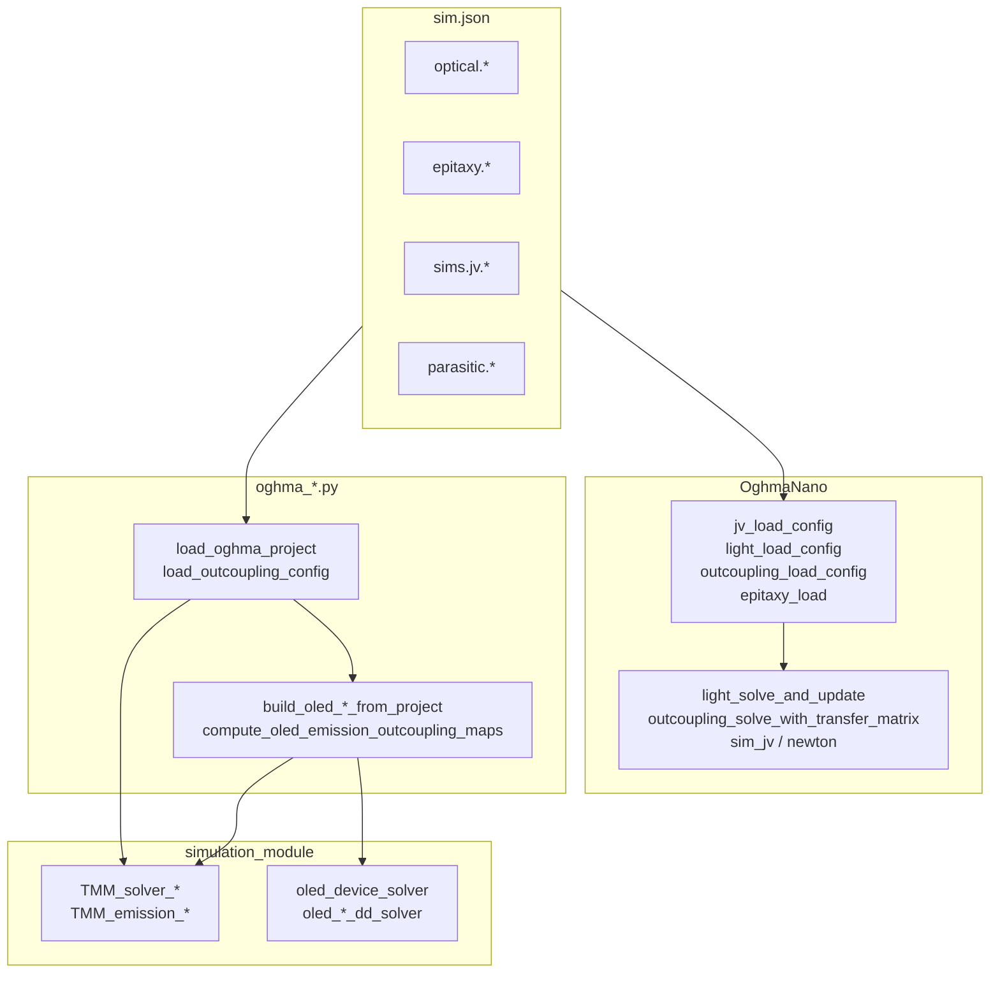
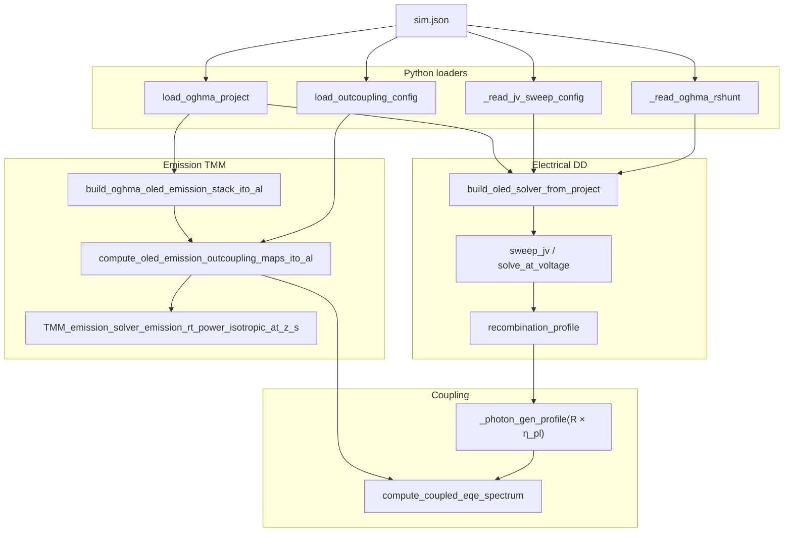

> **只读参考** — OghmaNano / gpvdm 等求解器源码为**仓外**依赖，须自备克隆路径。本仓库内 Oghma 工程数据在 `assets/database/og/oghma_projects/`（可选本机 symlink `assets/oghma_projects`）。

# Oghma sim.json ↔ OghmaNano ↔ simulation 接口映射

[`00_software_alignment_skills.md`](00_software_alignment_skills.md) 的扩展：三层映射（C API ↔ Python ↔ C++；sim.json ↔ loader；sim.json ↔ simulation 入参）。

参考实例：[`assets/database/og/oghma_projects/oled/02_oled_jv/sim.json`](../../../database/og/oghma_projects/oled/02_oled_jv/sim.json)（`simmode=segment0@jv`，`outcoupling_model=transfer_matrix`）。

---

## 方法论

OghmaNano 的 `json_template_*.c`（[`OghmaNano/oghma_core/libsavefile/`](../../../../OghmaNano/oghma_core/libsavefile/)）只**写默认 schema**，不做运行时解析。运行时通过 `json_get_*`（[`json.h`](../../../../OghmaNano/oghma_core/include/json.h)）填入 C struct，再调用 solver。

| 解析来源 | 可信度 | 示例 |
|---|---|---|
| OghmaNano 源码中的 `json_get_*` | 高 | `jv_load_config()` in [`jv.c`](../../../../OghmaNano/oghma_core/plugins/jv/jv.c) |
| JSON 模板 + struct 头文件 | 中 | `json_template_optical_outcoupling.c` → `outcoupling.h` |
| gpvdm 同源 loader | 中（字段名可能略有差异） | `epitaxy_load_pl_file()` in [`gpvdm/.../epitaxy.c`](../../../../gpvdm/gpvdm_core/libdevice/epitaxy.c) |
| 头文件函数声明、无 `.c` 实现 | 低（功能推测） | `outcoupling_load_config()` in [`outcoupling_fun.h`](../../../../OghmaNano/oghma_core/include/outcoupling_fun.h) |

simulation 侧入口：[`assets/ipynb/simulation/TMM/oghma_*.py`](.) → pybind `simulation_module`（`TMM_*`、`oled_*`）。



---

## 表 1：OghmaNano API ↔ oghma_*.py ↔ simulation_module

实现状态：**✅** 已实现 · **⚠️** 部分 · **❌** 未实现（从头文件推测）

### 1A. 光学 / Outcoupling / TMM

| OghmaNano API（头文件） | 语义 | oghma_*.py | simulation_module API | 状态 |
|---|---|---|---|---|
| `outcoupling_load_config()` | 读 outcoupling 配置 | `load_outcoupling_config()` [`oghma_core.py`](oghma_core.py) | — | ✅ 读 JSON |
| `outcoupling_solve_with_transfer_matrix()` | transfer_matrix 出耦合求解 | `compute_oled_emission_outcoupling_maps_ito_al()` → `build_eta_oghma_style_from_reference()` | —（Oghma CSV 公式；simulation escape 待重写） | ⚠️ 非完整 outcoupling DLL |
| `outcoupling_solve_ray_on_optical_mesh()` | ray_trace 出耦合 | `oghma_emission_u_values_from_project()` 仅 `ray_trace` 时读 `ray_theta_*` | 同上 + `u` 列表 | ⚠️ 无 ray engine |
| `outcoupling_solve_and_update()` | 求解并写回 device | — | — | ❌ |
| `light_load_config()` / `light_load_json()` | 读 light 配置 | FDTD：`parse_fdtd_light_source_config()` [`oghma_fdtd_source.py`](oghma_fdtd_source.py) | — | ❌ 无 JV 吸收 TMM 路径 |
| `light_solve_and_update()` | 吸收 TMM → generation | — | — | ❌ JV 光学走 emission + DD |
| `light_solve_optical_problem()` | 被动 R/T | `compute_oled_stack_rt_power_unpolarized()` | `TMM_solver_spectrum_rt_power_unpolarized_s` | ⚠️ |
| `light_solve_lam_slice()` | 单 λ 切片 | `_compute_emission_transfer()` 等 | `TMM_emission_solver_spectrum_emission_transfer_s` | ⚠️ |
| `light_src_load()` | 外部光源 | `load_outcoupling_config()` 读 `light_illuminate_from` | — | ⚠️ |
| `light_import_epitaxy()` | epitaxy → nk 数组 | `build_oghma_oled_*_stack_ito_al()` | `register_material` + `coating()` / `layers_from_formula` | ⚠️ OLED 专用 stack |
| `light_build_materials_arrays()` | 构建复折射率场 | `_make_oghma_optical_material()` | `simulation_database.read()` → `database_material` | ✅ |
| `light_cal_photon_density()` | 光子密度 | `load_oghma_photon_reference()` 读 CSV | — | ⚠️ 只读基准 |
| `epitaxy_load()` / `shape_load_from_json()` | 层几何/材料 | `load_oghma_project()` | — | ⚠️ 子集字段 |
| `epitaxy_load_pl_file()` | PL / ray 参数 | `load_oghma_project()` + `load_oghma_emission_efficiency()` | — | ⚠️ |
| `load_oghma_material_nk()`（Python） | materials DB nk | 同名 [`oghma_core.py`](oghma_core.py) | `simulation_database.read()` + `nk_at_wavelength_um` | ✅ |

**被动 / 发射 TMM 辅助（无直接 OghmaNano 同名 API，对齐输出 CSV）**

| oghma_*.py | simulation_module | 用途 |
|---|---|---|
| `spectrum_reflection_coeff_unpolarized_s()` | `TMM_solver_spectrum_reflection_coeff_unpolarized_s` | 批量复 r(λ) |
| `emission_rt_power_isotropic_at_z_py()` | `TMM_emission_solver_emission_rt_power_isotropic_at_z_s` | 各向同性 dipole R/T @ z |
| `compute_oled_emission_stack_rt_ito_al()` | `TMM_emission_solve_equivalent_plane_wave_{s,p}_s` | 等效平面波 R/T |
| `build_oghma_passive_stack()` | `layers_from_formula` + `build_tmm_layers`（`coating` 栈） | 光学滤光片 stack |
| `vacuum_reference_layers()` | `make_coating(...)`（`coating_solver_test_util`） | outcoupling 参考真空 slab |

### 1B. JV / 电学

| OghmaNano API | 语义 | oghma_*.py | simulation_module | 状态 |
|---|---|---|---|---|
| `jv_load_config()` | JV 扫描参数 | `_read_jv_sweep_config()` | `oled_device_solver.set_sweep()` | ✅ V 范围 |
| `sim_jv()` | JV 主循环 | `compute_oled_jv_optical_coupled*()` | `sweep_jv`, `solve_at_voltage` | ⚠️ 简化 1D solver |
| `charge_carrier_generation_model` 分支 | TMM vs ray | — | — | ❌ 未读 JSON |
| `newton_sim_simple()` | 漂移扩散 Newton | `build_oled_newton_solver_from_project()` | `oled_newton_dd_solver_d` | ⚠️ |
| Gummel 迭代（device 内部） | DD Gummel | `build_oled_gummel_solver_from_project()` | `oled_gummel_dd_solver_d` | ⚠️ |
| `contacts_load()` | 接触边界 | `_read_oghma_contact()` | `oled_dd_contact_params_d` | ⚠️ **JSON 路径错误** |
| `device_import_photon_gen_rate()` | 光学 generation → mesh | `_photon_gen_profile(R×η_pl)` | — | ⚠️ 间接 |
| parasitic Rshunt（device） | 并联电导 | `_read_oghma_rshunt_ohm_m2()` | `set_shunt_conductivity(1/Rshunt)` | ✅ |

### 1C. FDTD 对齐（Bragg / Fabry / 自由空间）

| OghmaNano（FDTD 模块，头文件 [`fdtd.h`](../../../../OghmaNano/oghma_core/include/fdtd.h)） | oghma_*.py | simulation_module |
|---|---|---|
| FDTD 光源/探测器 world 布局 | `parse_fdtd_layout()`, `parse_fdtd_source()` [`oghma_fdtd.py`](oghma_fdtd.py) | — |
| 时域波形 + 光谱包络 | `parse_fdtd_light_source_config()`, `compute_fdtd_source_spectrum_i_new()` | FFT（纯 Python） |
| 被动传递 | `compute_*_passive_transfer()` | `TMM_solver_rt_power_unpolarized_s` |
| Bragg 光栅几何 | `parse_bragg_grating_geometry()` [`oghma_bragg.py`](oghma_bragg.py) | 同上 + emission API |
| Fabry-Pérot 腔几何 | `parse_fabry_perot_geometry()` [`oghma_fabry.py`](oghma_fabry.py) | 同上 |
| 探测器基准 CSV | `load_oghma_fdtd_detector_reference()` | — |
| 对齐编排 | `load_fdtd_alignment_bundle()` [`oghma_fdtd_alignment.py`](oghma_fdtd_alignment.py) | — |

---

## 表 2：sim.json ↔ OghmaNano struct / loader

### 2A. JV（完整 runtime parser）

路径：`sims.jv.segment0.config.*` → `struct jv`（[`jv.h`](../../../../OghmaNano/oghma_core/plugins/jv/jv.h)），loader：[`jv_load_config()`](../../../../OghmaNano/oghma_core/plugins/jv/jv.c)。

| JSON path | C 字段 | 消费者 | parser 来源 |
|---|---|---|---|
| `Vstart` | `jv.Vstart` | `sim_jv()` 扫描起点 | jv.c ✅ |
| `Vstop` | `jv.Vstop` | 扫描终点 | jv.c ✅ |
| `Vstep` | `jv.Vstep` | 步长（反向扫时取负） | jv.c ✅ |
| `jv_step_mul` | `jv.jv_step_mul` | 非线性步进倍增 | jv.c ✅ |
| `jv_light_efficiency` | `jv.jv_light_efficiency` | `light_set_sun()` 后 `light_solve_and_update` | jv.c ✅ |
| `jv_max_j` | `jv.jv_max_j` | 电流密度上限终止 | jv.c ✅ |
| `jv_single_point` | `jv.jv_single_point` | 单点模式 | jv.c ✅ |
| `jv_use_external_voltage_as_stop` | `jv.jv_use_external_voltage_as_stop` | 外压作停点 | jv.c ✅ |
| `charge_carrier_generation_model` | `jv.charge_carrier_generation_model[200]` | `"transfer_matrix"`→`light_solve_and_update`；`"ray_trace"`→`ray_solve_all` | jv.c ✅ |
| `eqe_smooth` | `jv.eqe_smooth` | EQE 平滑 | jv.c ✅ |
| `dump_verbosity`, `dump_energy_space`, `dump_x/y/z`, `dump_sclc` | `jv.*` | dump 控制 | jv.c ✅ |
| `dump_sweep_save` | `sweep_store.dump_level` | sweep 存盘级别 | jv.c ✅ |
| `jv_Rcontact`, `jv_Rshunt` | — | **模板有，jv_load_config 未解析** | 模板 only |

### 2B. Outcoupling

路径：`optical.outcoupling.*` → `struct outcoupling`（[`outcoupling.h`](../../../../OghmaNano/oghma_core/include/outcoupling.h)），loader：`outcoupling_load_config()`（头文件声明，实现未开源）。

| JSON path | C 字段 | 消费者（推测） | parser 来源 |
|---|---|---|---|
| `outcoupling_model` | `outcoupling.mode[20]` | `outcoupling_solve_with_transfer_matrix` / ray 分支；`ray_check_if_needed()` 读此字段 | 头文件 + [`ray_src.c`](../../../../OghmaNano/oghma_core/libray/ray_src.c) 部分 ✅ |
| `incoherent_wavelengths` | `outcoupling.incoherent_wavelengths` | outcoupling λ 非相干叠加 | 模板 + 头文件 |
| `Dphotoneff` | `outcoupling.Dphotoneff` | 光子效率缩放 | 模板 + 头文件 |
| `dump_verbosity` | `outcoupling.dump_verbosity` | dump | 模板 |

### 2C. Light / 光学 mesh

路径：`optical.light.*`、`optical.mesh.*`、`optical.light_sources.*` → `struct light` / mesh（[`light.h`](../../../../OghmaNano/oghma_core/include/light.h)）。

| JSON path | C 字段 | 消费者 | parser 来源 |
|---|---|---|---|
| `optical.light.light_model` | `light.mode` | `light_set_model()` | gpvdm `light_config.c` |
| `optical.light.sun` | `light.suns_spectrum_file` | 太阳光谱文件 | gpvdm |
| `optical.light.Dphotoneff` | `light.Dphotoneff` | 吸收 scaling | 模板 + gpvdm |
| `optical.light.incoherent_wavelengths` | `light.incoherent_wavelengths` | λ 网格非相干 | 模板 |
| `optical.light_sources.Psun` | `light.Psun` | 光强 | gpvdm / ray |
| `optical.mesh.mesh_l.segment0.{start,stop,points,start_u,stop_u}` | optical λ 网格 | light / outcoupling solver | mesh 模板 |
| `optical.mesh.mesh_y.segment0.{len,points,len_u}` | y 深度网格 | outcoupling z-y 映射 | mesh 模板 |
| `optical.boundary.optical_y0/y1` | ABC/PML 边界标记 | 光学 solver 边界 | 模板 |
| `optical.light_sources.lights.segment0.light_illuminate_from` | `light_src.illuminate_from[20]` | `light_src_load()` → y0/y1 侧 | gpvdm `light_config.c` |
| `optical.light_sources.lights.segment0.ray_theta_*` | `light_src.theta_*` | 外部 ray 光源角度 | 模板 + gpvdm |
| `optical.lasers.segment0.config.laserwavelength` | `light.laser_wavelength` | 激光 / carrier λ 回退 | 模板 |

### 2D. Epitaxy / shape

路径：`epitaxy.segmentN.*` → `struct epi_layer` + `struct shape`（[`epitaxy_struct.h`](../../../../OghmaNano/oghma_core/include/epitaxy_struct.h)、[`shape_struct.h`](../../../../OghmaNano/oghma_core/include/shape_struct.h)）。

| JSON path | C 字段 | 消费者 | parser 来源 |
|---|---|---|---|
| `y0`, `dy`, `dx`, `dz`, `name`, `obj_type` | `shape.*` / `y_start,y_stop` | `shape_load_from_json()`, `json_populate_shape_from_json_world_object()` | [`json_world_object.c`](../../../../OghmaNano/oghma_core/libsavefile/json_world_object.c) 部分 ✅ |
| `optical_material` | `shape.optical_material[200]` | materials DB → nk | 头文件 |
| `Gnp` | `shape.Gnp` | 光生载流子比例 | 模板 |
| `solve_optical_problem` | `epi_layer.solve_optical_problem` | 是否参与光学 | 模板 |
| `shape_dos.Xi,Eg,mue_y,muh_y,Nc,Nv,free_to_free_recombination` | `dosn/dosp` | 电学 DD | `shape_load_dos()` 头文件 |
| `shape_electrical.electrical_J0,n,series_y,component` | `component` | 接触组件电阻/二极管 | 模板 |
| `shape_pl.pl_emission_enabled` | `epi_layer.pl_enabled` | EML 开关 | gpvdm `epitaxy_load_pl_file()` ✅ |
| `shape_pl.pl_input_spectrum` | `pl_spectrum_file` | 发射光谱路径 | gpvdm ✅ |
| `shape_pl.pl_experimental_emission_efficiency_f2f` | `pl_experimental_emission_efficiency`（gpvdm 名 `_f2f` 为 Oghma 扩展） | η_PL | gpvdm（字段名差异） |
| `shape_pl.ray_theta_{steps,start,stop}` | `theta_steps,start,stop` | **仅 ray_trace** | gpvdm ✅ |
| `shape_pl.ray_phi_*` | `phi_steps,start,stop` | ray_trace | gpvdm ✅ |
| `shape_pl.pl_fe_fh, pl_fe_te, …` | 偶极取向权重 | PL 模型 | gpvdm ✅ |

### 2E. Contacts（路径与 epitaxy segment 不同）

Oghma JSON：**`epitaxy.contacts.segmentN.contact.*`**（见 [`json_contacts.c`](../../../../OghmaNano/oghma_core/libsavefile/json_contacts.c) 中 `json_obj_find_by_path(..., "contact")`）。

gpvdm `contacts_load()` 读：`position`, `applied_voltage`, `majority`/`minority`（Oghma：`majority_model`/`minority_model`）, `contact_resistance_sq`, `shunt_resistance_sq`, `np`, 等。

| JSON path | 含义 | OghmaNano 消费者 |
|---|---|---|
| `epitaxy.contacts.segment0.contact.position` | `top` / `bottom` | `contacts_load()` |
| `majority`, `minority` | 载流子类型 | contacts |
| `majority_model`, `minority_model` | `ohmic` / `blocking` | contacts |
| `contact_resistance_sq`, `shunt_resistance_sq` | 接触/并联电阻 | contacts |
| `np`, `majority_v0`, `minority_mu`, … | 接触参数 | contacts |

**注意**：`02_oled_jv` 中 `epitaxy.segmentN` **不含** `contact` 子节点；contact 仅在 `epitaxy.contacts` 下。

### 2F. 其它

| JSON path | OghmaNano | 说明 |
|---|---|---|
| `parasitic.Rshunt` | device 并联 shunt | 非 jv.config 字段 |
| `math.{electricalerror,electricalclamp,maxelectricalitt,minelectricalitt}` | Newton 容差 | [`math`](../../../../OghmaNano/oghma_core/include/) 配置 |
| `sim.simmode` | `json_find_sim_struct()` 定位 sim 段 | 如 `segment0@jv` |
| `world.world_data.segment0.*` | FDTD / Bragg 几何 | world loader |

---

## 表 3：sim.json ↔ simulation 入参（合成映射）

### 3A. 光学 / Outcoupling → TMM

| JSON path | OghmaNano 入参 | oghma_*.py → simulation 入参 | 02_oled_jv 实测 | 对齐 |
|---|---|---|---|---|
| `optical.outcoupling.outcoupling_model` | `outcoupling.mode` | `oghma_emission_u_values_from_project()` → **`u=[0.0]`** | `transfer_matrix` | ✅ |
| `optical.outcoupling.incoherent_wavelengths` | `outcoupling.incoherent_wavelengths` | `load_outcoupling_config()` 记录，**未传 TMM** | `5` | ⚠️ |
| `optical.outcoupling.Dphotoneff` | `outcoupling.Dphotoneff` | **未读** | `1.0` | ❌ |
| `optical.mesh.mesh_l.segment0.*` | λ 网格 | `OghmaProject.wl_{start,stop}_um`, `wl_points` → `wl_list` | 0.3–0.58 μm, 40 pt | ✅ |
| `optical.mesh.mesh_y.segment0.*` | y 网格 | `y_mesh_len_um`, `y_mesh_points`；`oghma_y_mesh_um()` **优先 outcoupling CSV** | len=0.52 μm, 200 pt | ⚠️ |
| `optical.boundary.optical_y0/y1` | ABC 标记 | 校验；TMM 用 ITO/Al `depth=0` 半无限 bookend | `abc` / `abc` | ✅ |
| `optical.light_sources.lights.segment0.light_illuminate_from` | `illuminate_from` | OLED 固定 ITO 侧 → `incident_angle_rad=0` | `y0` | ✅ |
| `epitaxy.segmentN.optical_material` | materials path | `_make_oghma_optical_material()` → `database_material` / `i_material` | 如 `oxides/ITO/ito` | ✅ |
| `epitaxy.segmentN.{y0,dy}` | 层厚 | `OghmaLayer.y0_um`, `thickness_um` → `coating.depth`；**z = y** | ITO @ y=0 | ✅ |
| `shape_pl.pl_emission_enabled` | `pl_enabled` | EML 识别；`oled_layer_params.radiative` | Alq3: `True` | ✅ |
| `shape_pl.pl_experimental_emission_efficiency_f2f` | η_PL | `lp.eta_pl`, `load_oghma_emission_efficiency()` | `0.25` | ✅ |
| `shape_pl.pl_input_spectrum` | 光谱文件 | `find_emission_spectrum_path()` → `compute_coupled_eqe_spectrum()` | `small_molecules/Alq3` | ✅ |
| `shape_pl.ray_theta_*` | ray 角网格 | **`transfer_matrix` 强制忽略** → `u=0` | steps=180 | ✅ 有意 |
| `epitaxy.segment0/last.optical_material` | ITO / Al | `build_oghma_oled_*_stack_ito_al()` bookend nk | ITO + Al | ✅ |

**TMM 调用链（outcoupling 对齐）**

```
load_oghma_project + load_outcoupling_config
  → build_oghma_oled_emission_stack_ito_al(lam)
      → register_material / database_material + coating(depth)
  → oghma_emission_u_values_from_project → u
  → TMM_emission_solver_emission_rt_power_isotropic_at_z_s(layers, wl, u, z)
```

### 3B. JV / 电学 → OLED solver

| JSON path | OghmaNano | oghma_*.py → simulation | 02_oled_jv 实测 | 对齐 |
|---|---|---|---|---|
| `sims.jv.segment0.config.Vstart/Vstop/Vstep` | `jv.*` | `set_sweep(0.1, 4.0, 0.01)` | 0.1 / 4.0 / 0.01 | ✅ |
| `sims.jv.config.jv_step_mul` | 非线性步进 | **未读** | `1.0` | ⚠️ 线性步进等价 |
| `sims.jv.config.jv_light_efficiency` | sun 缩放 | **未读** | `1.0` | ❌（=1 时无影响） |
| `sims.jv.config.charge_carrier_generation_model` | TMM/ray 分支 | **未读** | `transfer_matrix` | ⚠️ |
| `parasitic.Rshunt` | shunt | `set_shunt_conductivity(1/1.2)` | 1.2 Ω·m² | ✅ |
| `shape_dos.*` | DOS | `oled_layer_params_d.{xi_ev,eg_ev,mue,muh,nc,nv,k_f2f}` | 各层 DOS | ⚠️ `eps_r=3.0` 硬编码 |
| `shape_electrical.{J0,n,series_y}` | 组件 | `oled_dd_contact_params_d.{j0_a_m2,ideality_n,series_r_y_ohm_m2}` | J0=5e-9 等 | ✅ 来自 layer shape |
| `epitaxy.contacts.segment0/1.contact.*` | `contacts_load()` | `_read_oghma_contact(epitaxy.segmentN.contact)` **路径错误** | top/bottom ohmic | ❌ 见表 4 |
| `math.*` | Newton 容差 | `oled_dd_newton_settings_d` | 默认 math 块 | ✅ Newton 路径 |

**JV + 光学耦合链**

```
build_oled_solver_from_project → sweep_jv / solve_at_voltage / recombination_profile
compute_oled_emission_outcoupling_maps_ito_al → η_esc(λ,y)
compute_coupled_eqe_spectrum → v_eqe, v_luminance
```

### 3C. FDTD（非 02_oled_jv 主路径，供 Bragg/Fabry 对齐）

| JSON path | oghma_*.py | simulation |
|---|---|---|
| `optical.light_sources.lights.segment0.light_source.fdtd.*` | `parse_fdtd_source()` | — |
| `virtual_spectra.light_spectra.segment0.light_spectrum` | `parse_fdtd_light_source_config()` | — |
| `world.world_data.segment0.{dz,dz_step,optical_material}` | `parse_fabry_perot_geometry()` / `parse_bragg_grating_geometry()` | TMM stack |
| `optical.detectors.segment0/1.z0` | `parse_fdtd_layout()` | 与 `lam_E.csv` 基准对齐 |

---

## 表 4：正确性核查

静态对照 + `02_oled_jv` 运行时打印（2026-06-17）验证。

### ✅ 已确认正确

| 项 | 证据 |
|---|---|
| `transfer_matrix` → `u=[0.0]` | `oghma_emission_u_values_from_project(02_oled_jv)` 输出 `[0.0]`；与 [`00_software_alignment_skills.md`](00_software_alignment_skills.md) 一致 |
| `ray_theta_*` 不驱动 emission-TMM | `outcoupling_model=transfer_matrix` 时忽略 PL 层 `ray_theta_steps=180` |
| 坐标 z = y | `gpvdm_y_to_z_simulation_um` 恒等；ITO @ y=0 ↔ TMM layer 1 @ z=0 |
| nk 对齐 | `_read_oghma_material()` → `simulation_database.read()` + `nk_at_wavelength_um()` |
| OLED stack bookend | ITO(∞)\|layers\|Al(∞)，`depth=0` 半无限层 |
| JV 扫描 | `(0.1, 4.0, 0.01)` 正确传入 |
| η_PL | EML `pl_experimental_emission_efficiency_f2f=0.25` → `load_oghma_emission_efficiency()=0.25` |
| λ 网格 | mesh_l 300–580 nm, 40 points → `OghmaProject.wl_*` |
| `light_illuminate_from=y0` | 与 ITO 侧法向 passive/emission 约定一致 |

### ❌ / ⚠️ 问题与修复建议

| 问题 | 严重度 | 详情 | 建议 |
|---|---|---|---|
| Contact JSON 路径 | **高** | `_read_oghma_contact()` 读 `epitaxy.segmentN.contact`；`02_oled_jv` 中 **不存在** 该键。实际在 `epitaxy.contacts.segmentN.contact`。J0/n/series_y 来自 `shape_electrical`；majority 模型靠 **segment 序号默认值**（seg0→hole, seg5→electron），与 `contacts.segment1` 的 electron 阴极 **碰巧一致** | 改为读 `epitaxy.contacts`；anode=`segment0`, cathode=`segment1` |
| `jv_light_efficiency` 未读 | 中 | Oghma：`light_set_sun(sun×jv_light_efficiency)` 再 TMM | 光学耦合或 generation 路径补乘子 |
| `charge_carrier_generation_model` 未读 | 中 | 无法区分 `ray_trace` JV 路径 | 读 JSON 并分支 |
| `Dphotoneff` 未读 | 低 | outcoupling/light 均有此字段 | P1 补读并缩放 |
| `eps_r=3.0` 硬编码 | 中 | 未从材料/shape 读介电常数 | 从 shape 或 materials 读入 |
| `jv_step_mul` 未读 | 低 | Oghma 非线性 V 步进 | 实现倍增步进或文档声明不支持 |
| 电学 mesh vs `optical.mesh_y` | 低 | DD 用 `oghma_y_mesh_um()`，有 CSV 时与 mesh_y 200 点可能不同 | 对比时注明 y 轴来源 |
| gpvdm 字段名 | 低 | `pl_experimental_emission_efficiency` vs `_f2f` | simulation 已用 Oghma 命名 ✅ |
| OghmaNano optical loader 未开源 | 信息 | 表 2B–2C 部分为头文件推测 | 以 gpvdm + 输出 CSV 交叉验证 |

### 运行时验证摘要（02_oled_jv）

```
layers: 6  ['ITO Contact', 'NPD (HTL)', 'Alq3 (EML)', 'TPBi (ETL)', 'LiF', 'Al']
wl: 300.0 – 580.0 nm, 40 points
outcoupling: transfer_matrix, u=[0.0]
JV sweep: (0.1, 4.0, 0.01), Rshunt=1.2
eta_pl: 0.25
epitaxy.segment0.contact 存在: False
epitaxy.contacts.segment0.contact: top, hole/electron, ohmic/blocking
epitaxy.contacts.segment1.contact: bottom, electron/hole, ohmic/blocking
```

---

## JV + 光学耦合数据流（02_oled_jv）



---

## 相关文件索引

| 类别 | 路径 |
|---|---|
| simulation Python | [`oghma_core.py`](oghma_core.py), [`oghma_oled_utils.py`](oghma_oled_utils.py), [`oghma_fdtd*.py`](.), [`oghma_bragg.py`](oghma_bragg.py), [`oghma_fabry.py`](oghma_fabry.py) |
| 对齐技能 | [`00_software_alignment_skills.md`](00_software_alignment_skills.md) |
| OghmaNano JV parser | [`OghmaNano/oghma_core/plugins/jv/jv.c`](../../../../OghmaNano/oghma_core/plugins/jv/jv.c) |
| OghmaNano 模板 | [`OghmaNano/oghma_core/libsavefile/json_template_*.c`](../../../../OghmaNano/oghma_core/libsavefile/) |
| gpvdm PL loader | [`gpvdm/gpvdm_core/libdevice/epitaxy.c`](../../../../gpvdm/gpvdm_core/libdevice/epitaxy.c) |
| 实例项目 | [`assets/database/og/oghma_projects/oled/02_oled_jv/`](../../../database/og/oghma_projects/oled/02_oled_jv/) |
| pytest 对齐 | [`test_oghma_oled_alignment.py`](test_oghma_oled_alignment.py) |
| JV pytest | [`test_oghma_oled_jv.py`](test_oghma_oled_jv.py)（`--profile default\|gummel\|newton`） |

---

## 可选后续修复（未在本文档实施）

1. `_read_oghma_contact` 改为读取 `epitaxy.contacts.segmentN.contact`
2. 补读 `jv_light_efficiency`、`Dphotoneff`、`charge_carrier_generation_model`
3. `eps_r` 与 contact 参数完全 JSON 驱动
