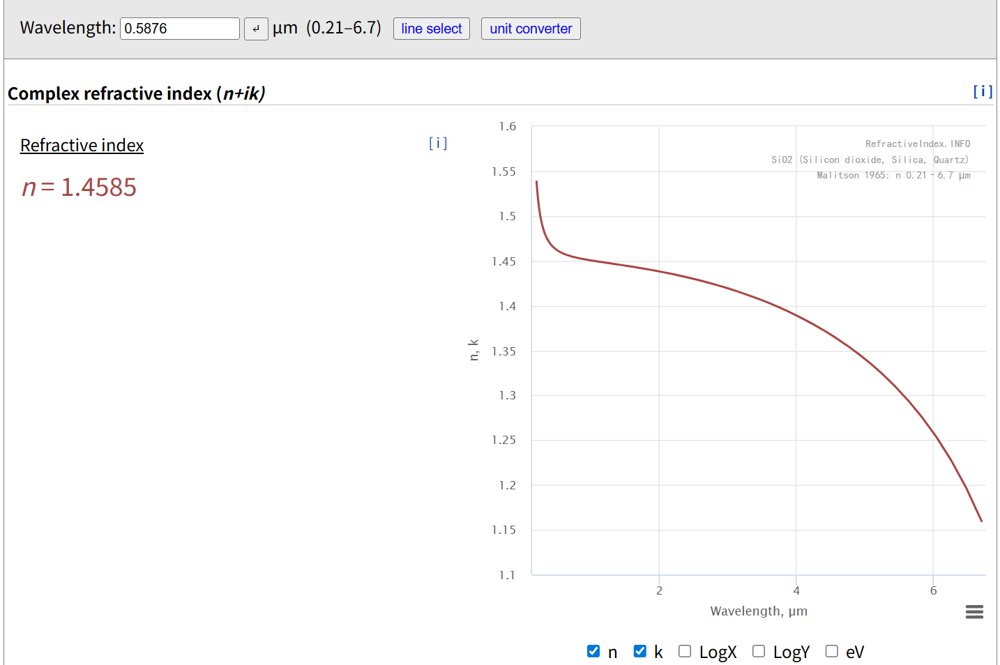
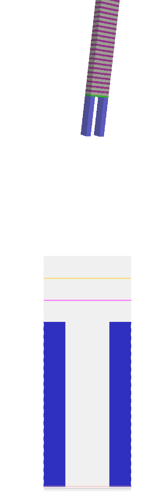
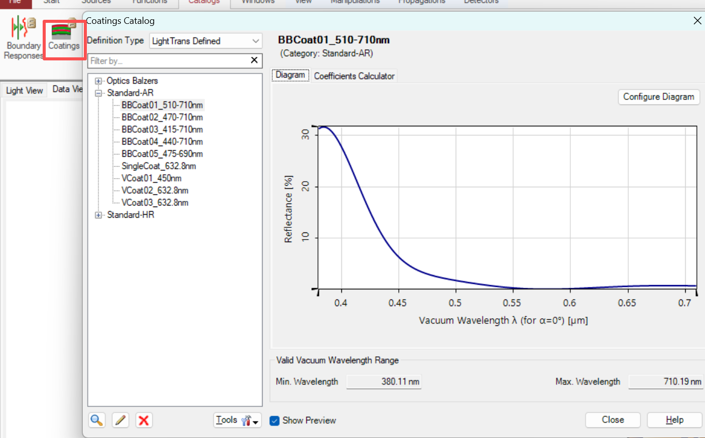

#### 网站功能计划

##### 输入模型建模
1. 搜集不同波长下的材料参数
- 结果展示

- 目标
用户输入任何一个材料名称, 比如二氧化硅 SiO2, 都从开源数据库里面下载, 用于给客户建模。  
或者我们可以提前把常用的材料用爬虫爬下来，做成自己的数据库。 
这一步可以定义函数 : Meterial(wavelength)  
表示材料属性是一个和波长相关的函数。
用户可以选择多个材料，也就是定义了一组 Meterial(wavelength) 的函数。   
比如:  
air(空气/真空) : Meterial of air(wavelength)  
SiO2(二氧化硅) : Meterial of SiO2(wavelength), 上图展示的就是 Meterial of SiO2   
对于数据库中不存在的材料，我们也可以让用户进行导入，定义自己的 Meterial(wavelength) 函数  

2. filmstack 建模及可视化
- 结果展示  
含义解释 :  
`蓝色:` 表示设置了结构的膜层, 结构在xy平面看是两个矩形, 在z方向上深度大约是x/y平面的3倍。  
`粉/灰/绿 :` 分别表示3种不同的材料, 在 xz方向看没有镂空, 表示这是一个没有设置结构的膜层。  
可视化可以分为2d/3d， 下图中的 2d 可视化貌似有bug。

- 目标
用户可以设置每一层膜系材料参数(参数来自于需求 1)和材料的厚度(z 方向的长度)， 这一步称为材料结构建模/ filmstack 建模，并提供模型可视化。  
用户指定每一层的材料名称, 比如 SiO2 就可以实现字符串和 Meterial(wavelength) 函数绑定。  
此外，对于需要定义结构的膜层, 最理想的情况需要提供图形绘制功能，但是这个工作量比较大, 并且有替代方案。  
图形绘制可以让用户上传定画好的文件,业内常用 gds/oas 文件格式。  
或者我们干脆暂时不支持带结构的模型也是可以的!  

--------------------------------------------------------------------------------------------------------------

##### 仿真
以下仿真案例都是基于不带结构的 filmstack 模型。  

1. virtual-lab coating 模块
- 结果展示  
含义解释 :  计算 filmstack 在不同波长(wavelength)下的反射率/透过率, 通过计算结果，用户可以评估膜系的好坏。应用场景：手机屏幕建模  
返回一个 T(wavelength)/R(wavelength) 的函数, 即在不同波长下的反射率(Reflectance)/透过率(Transmittance)。

- 2个应用场景
1. 用户输入一个波长范围，以 LED 玻璃盖板建模为例，输入的波长范围通常是可见光的波长范围， 计算出在可见光范围内设 filmstack 的反射率/透过滤。  
通过 T(wavelength) 曲线， 我们可以评估 filmstack 的设计是否省电。 (透过率越高, 屏幕越省电)    

2. 用户输入一个固定的波长, 我们可以计算出膜系在不同角度下的反射率/透过率, 用于评估屏幕在不同角度下的性能。
